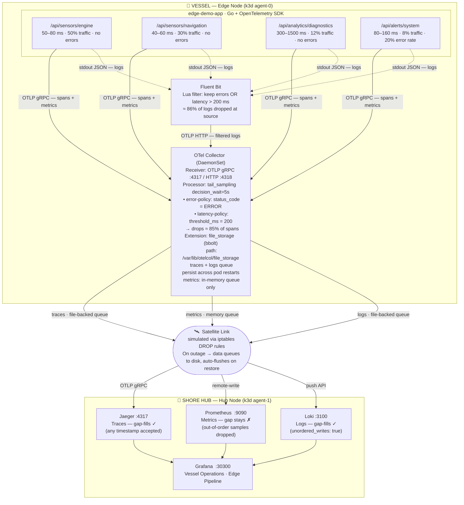

# Observability on the Edge

**"Making Observability Work at the Edge"** — KubeCon EU 2026

A production-realistic demo of the full observability stack for edge computing: intelligent tail-based sampling, file-backed persistent queues for network resilience, and unified correlation of traces, logs, and metrics. The scenario is a maritime vessel with intermittent satellite connectivity, but the patterns apply to any edge deployment.

---

## Table of Contents

1. [What this demonstrates](#what-this-demonstrates)
2. [Architecture](#architecture)
3. [Key Concepts](#key-concepts)
   - [Tail-Based Sampling](#tail-based-sampling)
   - [Persistent Queues and Network Resilience](#persistent-queues-and-network-resilience)
   - [Signal Correlation](#signal-correlation)
   - [Out-of-Order Ingestion](#out-of-order-ingestion)
4. [Components](#components)
5. [Quick Start](#quick-start)
6. [Running the Demo](#running-the-demo)
7. [Dashboard Guide](#dashboard-guide)
8. [Configuration Reference](#configuration-reference)
9. [Design Decisions and Trade-offs](#design-decisions-and-trade-offs)
10. [Project Structure](#project-structure)
11. [Troubleshooting](#troubleshooting)

---

## What this demonstrates

| Capability | What you see |
|---|---|
| **Tail-based sampling** | OTel Collector drops ~85% of spans while keeping all errors and slow requests. A gauge shows the live reduction ratio. |
| **Intelligent log filtering** | Fluent Bit applies identical criteria at the source — only errors and slow requests leave the edge node. |
| **Network resilience** | Simulate a satellite link loss: data queues to disk, the app keeps running, and everything syncs when the link comes back. |
| **Signal correlation** | Every log entry has a `trace_id` you can click to jump to the trace in Jaeger. Metrics have exemplars linking data points to traces. |
| **Edge topology** | Two Kubernetes nodes, explicitly labelled `edge` and `hub`, with traffic crossing between them just like a real WAN link. |

---

## Architecture



> **PNG version:** `architecture.mmd` is in the repo root. Generate with:
> `mmdc -i architecture.mmd -o architecture.png -t neutral -b white`

### Why two nodes?

k3d creates one `agent-0` (labelled `node-role=edge`) and one `agent-1` (labelled `node-role=hub`). All Kubernetes manifests use `nodeSelector` to pin workloads to the right node. Traffic between them crosses the k3d virtual network — the same bridge the iptables rules later block.

This is not cosmetic: when we add a DROP rule to the FORWARD chain of the edge node's container, packets stop flowing across the virtual WAN link exactly as they would in a real satellite failure.

---

## Key Concepts

### Tail-Based Sampling

**The problem:** A vessel generates thousands of "engine reading normal" spans per minute. These have zero diagnostic value. Sending all of them to a central backend wastes satellite bandwidth and makes the backend expensive to run.

**Head sampling** (the naive solution) flips a coin at the start of each request: keep with probability P, discard otherwise. This reduces volume but discards errors and slow requests with probability (1-P). You can't debug what you didn't keep.

**Tail sampling** waits until the entire trace is complete before deciding. The OTel Collector buffers incoming spans in memory for `decision_wait: 5s`. Once the trace is complete (or the timer fires), it evaluates the policies:

```yaml
# k8s/edge-node/otel-collector-config.yaml
processors:
  tail_sampling:
    decision_wait: 5s        # hold spans in memory before deciding
    num_traces: 10000        # max concurrent traces in buffer
    policies:
      - name: error-policy   # keep ALL traces with any ERROR status span
        type: status_code
        status_code:
          status_codes: [ERROR]

      - name: latency-policy # keep ALL traces that took longer than 200ms
        type: latency
        latency:
          threshold_ms: 200
```

With the demo's traffic mix:

| Endpoint | % traffic | Latency | Errors | Sampled? |
|---|---|---|---|---|
| engine | 50% | 50–80ms | none | **dropped** |
| navigation | 30% | 40–60ms | none | **dropped** |
| diagnostics | 12% | 300–1500ms | none | **kept** (100% > 200ms) |
| alerts | 8% | 80–160ms | 20% | errors **kept**, rest dropped |

Result: ~86% reduction, keeping everything that matters.

**Fluent Bit mirrors the same logic.** The Lua filter in `k8s/edge-node/fluentbit-config.yaml` applies the identical threshold (200ms, error status). Every sampled trace has exactly one log entry and every log entry has a traceable trace — the correlation is structural, not accidental.

**Trade-offs of tail sampling:**

| Pro | Con |
|---|---|
| Keeps 100% of errors regardless of rate | Requires memory to buffer in-flight traces |
| Keeps 100% of slow requests | All spans of a trace must arrive at the **same** collector instance |
| Deterministic — no random blind spots | `decision_wait` adds 5s latency before export |
| Can inspect the full trace before deciding | Not suitable when traces span multiple nodes with different collectors |

The last constraint matters at scale: tail sampling with a DaemonSet works because all spans for a single request originate on the same edge node and land on the same collector. For multi-service distributed traces you need a stateful gateway collector tier or you fall back to probabilistic sampling.

---

### Persistent Queues and Network Resilience

When the satellite link fails, the OTel Collector cannot reach Jaeger, Loki, or Prometheus. Without queuing, every batch that fails to export is dropped permanently. With file-backed persistent queues, failed batches are written to disk and retried on the next cycle.

**How it works:**

```yaml
# k8s/edge-node/otel-collector-config.yaml
extensions:
  file_storage:
    directory: /var/lib/otelcol/file_storage  # bbolt files land here
    timeout: 10s

exporters:
  otlp/jaeger:
    sending_queue:
      enabled: true
      queue_size: 1000      # max batches queued before oldest are dropped
      storage: file_storage # persist to disk via bbolt
    retry_on_failure:
      enabled: true
      initial_interval: 5s
      max_interval: 30s
      max_elapsed_time: 300s # permanent drop after 5 minutes of retrying

  loki:
    sending_queue:
      enabled: true
      storage: file_storage  # same extension, separate bbolt file
    retry_on_failure: ...
```

The `file_storage` extension uses [bbolt](https://github.com/etcd-io/bbolt), an embedded key-value store. Each failed batch is serialised to disk under `/var/lib/otelcol/file_storage/`. You can inspect the files directly:

```bash
docker exec k3d-edge-observability-agent-0 ls -lah /var/lib/otelcol/file_storage/
# exporter_loki__logs          ← log queue
# exporter_otlp_jaeger_traces  ← trace queue
```

**Important:** bbolt never shrinks pages — files grow during outages but do not reduce after the queue drains. The authoritative queue depth is the metric `sum(otelcol_exporter_queue_size)`, not the file size.

**The queue volume is mounted via `hostPath`:**

```yaml
volumes:
  - name: file-storage
    hostPath:
      path: /var/lib/otelcol/file_storage
      type: DirectoryOrCreate
```

Queue data survives pod restarts, OOM kills, and node maintenance windows. A new pod reads from the same directory and drains the backlog. In production you would use a dedicated PersistentVolume, but `hostPath` is correct for a single-node edge device.

**Retry backoff:** first failure waits `initial_interval: 5s`, then 10s, 20s, 30s, 30s... Permanent drop after `max_elapsed_time: 300s`. Size your queue to cover your worst-case outage duration × data rate.

**What does not have file-backed queuing:** the `prometheusremotewrite` exporter does not support `sending_queue.storage` in OTel Collector v0.95. Metrics queue in memory only. If the pod is killed during an outage, queued metrics are lost. See [Design Decisions](#design-decisions-and-trade-offs) for why we use `prometheusremotewrite` anyway.

---

### Signal Correlation

Every request through the demo app produces three correlated signals:

**Trace (if sampled):** the full span tree, including timing and attributes, exported to Jaeger via OTLP gRPC.

**Log (if sampled):** a structured JSON log line with the same `trace_id` and `span_id` embedded:

```json
{"level":"INFO","ts":"...","trace_id":"7f09115e0c633db7","span_id":"...","msg":"request completed","latency_ms":842,"status":200}
```

Fluent Bit tails the pod log file, parses the JSON, and forwards it to the OTel Collector via OTLP HTTP. The collector adds Kubernetes resource labels and pushes to Loki. In Grafana, clicking the `trace_id` value in any log line opens a drilldown to Jaeger automatically.

**Metric:** HTTP request counters and histograms from the OTel SDK, scraped by Prometheus. Histograms carry **exemplars** — sample points annotated with a `trace_id`. Grafana renders exemplars as dots on histogram panels; clicking a dot opens the corresponding trace.

The Fluent Bit Lua filter and the OTel sampling policies use the same threshold values by design. This structural guarantee means no orphaned logs (log exists, trace dropped) and no orphaned traces (trace exists, log dropped).

---

### Out-of-Order Ingestion

When the satellite link is restored, the collector drains its file-backed queues. Batches queued during the outage carry their **original timestamps** — they arrive out of chronological order. Each backend handles this differently:

| Backend | Out-of-order support | After restore |
|---|---|---|
| **Jaeger** | Always accepted — traces are indexed by trace ID, timestamp is metadata | Gap fills ✓ |
| **Loki** | `unordered_writes: true` in `limits_config` | Gap fills ✓ |
| **Prometheus** | Remote-write endpoint silently drops samples older than the TSDB head | Gap stays ✗ |

The Prometheus behaviour is intentional: re-ingesting old samples would corrupt range queries. The gap is the signal — it shows exactly when connectivity was lost and restored.

After restore, set Grafana time range to "last 30 minutes":
- **Logs:** failure-window entries reappear with original timestamps
- **Metrics:** flat gap during outage, then resumes — gap stays
- **Jaeger:** filter to the outage time range to see recovered traces

---

## Components

| Component | Node | Image | Role |
|---|---|---|---|
| **edge-demo-app** | edge | custom Go | Simulates maritime sensors; emits OTLP traces + metrics, structured JSON logs |
| **OTel Collector** | edge | `otel/opentelemetry-collector-contrib:0.95.0` | Tail sampling, batching, file-backed queuing, fan-out to hub |
| **Fluent Bit** | edge | `fluent/fluent-bit:2.2` | Log collection, Lua filtering, OTLP HTTP push to collector |
| **Jaeger** | hub | `jaegertracing/all-in-one:1.54` | Trace storage and UI |
| **Prometheus** | hub | `prom/prometheus:v2.49.1` | Metrics storage, remote-write target |
| **Loki** | hub | `grafana/loki:2.9.4` | Log aggregation with out-of-order ingestion |
| **Grafana** | hub | `grafana/grafana:10.3.3` | Unified dashboards, cross-signal correlation |
| **k6 (via Operator)** | edge | `grafana/k6:latest` | 40-minute sustained load test managed by the k6 Kubernetes Operator |

### Load test details

The k6 script (`load-tests/k6-script.js`) runs 8 virtual users for 40 minutes sustaining this traffic mix:

| Endpoint | Share | Latency | Error rate | Sampling outcome |
|---|---|---|---|---|
| `/api/sensors/engine` | 50% | 50–80ms | 0% | dropped |
| `/api/sensors/navigation` | 30% | 40–60ms | 0% | dropped |
| `/api/analytics/diagnostics` | 12% | 300–1500ms | 0% | kept (latency policy) |
| `/api/alerts/system` | 8% | 80–160ms | 20% | errors kept, rest dropped |

The load test is managed by the [k6 Operator](https://github.com/grafana/k6-operator) as a `TestRun` custom resource — it runs entirely in-cluster and survives laptop sleep or network changes.

---

## Quick Start

### Prerequisites

```bash
# macOS
brew install docker k3d kubectl

# Verify
docker --version    # 24+
k3d --version       # 5+
kubectl version     # 1.28+
```

Docker Desktop must be running. k3d uses Docker containers as Kubernetes nodes.

### Setup (~5 minutes)

```bash
git clone <repo-url>
cd observability-on-edge
./scripts/setup.sh
```

`setup.sh` builds the app image, creates the k3d cluster, labels nodes, installs the k6 Operator, and deploys all workloads. Expected output:

```
✅ Setup Complete!
   Grafana:  http://localhost:30300  (admin / admin)
   Jaeger:   http://localhost:30686
```

### Start load test

```bash
./scripts/load-generator.sh
```

Creates a `TestRun` CR. The k6 Operator starts a runner pod. Leave it running for the duration of the demo.

### Run the demo

```bash
./scripts/demo.sh          # full run: preflight → Act 1 → Act 2 → Act 3
./scripts/demo.sh 2        # start at Act 2 (sampling)
./scripts/demo.sh 3        # start at Act 3 (failure/restore only)
```

`demo.sh` runs preflight checks, guides through each act interactively, automates the network failure and restore, and prints a pass/fail summary.

### Cleanup

```bash
./scripts/cleanup.sh       # deletes the k3d cluster and all data
```

---

## Running the Demo

### Act 1 — The system works (~5 min)

**Open: Grafana → Vessel Operations dashboard**

**What to point at:**

- **Stat panels (top):** Request Rate, Error Rate (~1.5–2%), P95 Latency (dominated by diagnostics)
- **Time series (middle):** four distinct lines in Request Rate by Endpoint; diagnostics visibly much slower in the latency panel
- **Logs panel (bottom):** structured JSON with `trace_id`. **Key observation:** only errors and slow requests appear here — fast engine/navigation reads are absent. Fluent Bit filtered them at the source before they consumed satellite bandwidth.

### Act 2 — We don't send everything (~7 min)

**Open: Grafana → Edge Pipeline dashboard → SAMPLING section**

- **Trace Data Reduction gauge:** ~83–87% in steady state. This is the live sampling ratio.
- **Trace Flow — Received vs Exported:** blue line (received by collector) always higher than green (exported to Jaeger). The gap is what tail sampling drops.
- **Log Flow — Fluent Bit Input vs Forwarded:** same gap, applied at Fluent Bit before the collector even sees the logs.

The two gaps use identical criteria — this is the structural guarantee of 1:1 log/trace correlation.

### Act 3 — The link fails, data survives (~8 min)

**Open: Grafana → Edge Pipeline dashboard → RESILIENCE section**

#### Step 1 — Break the satellite link

```bash
./scripts/simulate-network-failure.sh
```

Adds iptables DROP rules on the edge node's FORWARD chain. No pod restarts. The collector keeps receiving telemetry; it just can't send.

**Watch in Grafana (RESILIENCE section):**
- **Export Throughput** drops to zero within ~30s
- **Queue Depth (batches)** starts rising — batches serialising to disk

**Inspect the files on disk:**
```bash
docker exec k3d-edge-observability-agent-0 ls -lah /var/lib/otelcol/file_storage/
```

Wait at least 90 seconds for a visible drain spike on restore.

#### Step 2 — Restore the link

```bash
./scripts/restore-network.sh
```

Removes the DROP rules. The next retry attempt succeeds. The collector drains the queue.

**Watch in Grafana (RESILIENCE section):**
- **Export Throughput** spikes above baseline (queue drain burst), then settles
- **Queue Depth** drops back to 0

**Switch to Vessel Operations, set time range to "last 30 minutes":**
- Logs: failure-window entries reappear with original timestamps
- Metrics: flat gap stays — Prometheus drops out-of-order samples silently
- In Jaeger: filter to the outage time range to see recovered traces

---

## Dashboard Guide

### Vessel Operations

The application view — what operators watch in production.

| Panel | What to look for |
|---|---|
| Request Rate / Error Rate / P95 Latency | Overall health; error rate ~1.5–2% is normal |
| Request Rate by Endpoint | Four distinct lines; sensors higher volume |
| Latency by Endpoint | Diagnostics visually much slower |
| Logs | `trace_id` links; entries stop during failure, backfill on restore |

### Edge Pipeline

The pipeline view — collector health and the satellite link.

**SAMPLING section:**

| Panel | Query | Meaning |
|---|---|---|
| Trace Data Reduction | `(1 - sent/received) * 100` | Live % dropped by tail sampling |
| Trace Flow | `rate(accepted_spans[30s])` vs `rate(sent_spans[30s])` | Visual gap = sampling |
| Log Flow | Fluent Bit input vs forwarded | Identical filtering at source |

**RESILIENCE section:**

| Panel | Query | Meaning |
|---|---|---|
| Export Throughput | `rate(sent_spans[30s])` + `rate(sent_log_records[30s])` | Drops to 0 on failure, spikes on restore |
| Permanent Data Drops | `increase(send_failed_spans[5m]) + increase(send_failed_log_records[5m])` | 0 = queue working; increments only after >5 min outage |
| Queue Depth (batches) | `sum(otelcol_exporter_queue_size) or vector(0)` | Real-time batches on disk; `or vector(0)` ensures the panel shows 0 when queues are empty (OTel only emits this metric when non-zero) |

---

## Configuration Reference

### OTel Collector (`k8s/edge-node/otel-collector-config.yaml`)

```yaml
extensions:
  file_storage:
    directory: /var/lib/otelcol/file_storage
    timeout: 10s

processors:
  tail_sampling:
    decision_wait: 5s     # increase for slow services; memory grows proportionally
    num_traces: 10000     # lower on constrained hardware
    policies:
      - name: error-policy
        type: status_code
        status_code: {status_codes: [ERROR]}
      - name: latency-policy
        type: latency
        latency: {threshold_ms: 200}   # must match Fluent Bit Lua filter

  batch:
    timeout: 5s
    send_batch_size: 512
    send_batch_max_size: 1024

exporters:
  otlp/jaeger:
    sending_queue:
      storage: file_storage
      queue_size: 1000          # 1000 batches × 512 spans = up to 512K spans queued
    retry_on_failure:
      initial_interval: 5s
      max_interval: 30s
      max_elapsed_time: 300s    # permanent drop after 5 min

  prometheusremotewrite:        # no sending_queue.storage support in v0.95
    endpoint: http://prometheus...:9090/api/v1/write
```

### Fluent Bit (`k8s/edge-node/fluentbit-config.yaml`)

The Lua filter is the critical piece:

```lua
function filter_by_relevance(tag, timestamp, record)
  local status  = record["status"]     or 0
  local latency = record["latency_ms"] or 0
  if status >= 500 or latency >= 200 then
    return 1, timestamp, record   -- keep
  end
  return -1  -- drop before forwarding to OTel Collector
end
```

This runs on every log line before it leaves the edge node. Records that don't match are discarded — they never consume satellite bandwidth.

### Loki (`k8s/hub-node/loki-config.yaml`)

```yaml
limits_config:
  unordered_writes: true   # accept log entries with out-of-order timestamps
```

Without this, Loki rejects log records arriving after the ingester watermark has advanced past their timestamp.

### Prometheus (`k8s/hub-node/prometheus-config.yaml`)

```yaml
scrape_configs:
  - job_name: otel-collector
    static_configs:
      - targets: ['otel-collector.observability.svc.cluster.local:8888']
```

Prometheus scrapes the collector's built-in metrics endpoint (`:8888`), which exposes all `otelcol_exporter_*` and `otelcol_receiver_*` metrics used by the Grafana dashboards.

---

## Design Decisions and Trade-offs

### Why iptables DROP instead of a Kubernetes NetworkPolicy?

k3d uses Flannel without network policy support by default. More importantly, a NetworkPolicy requires a Kubernetes API call to apply and remove — adding latency and a dependency on the control plane. iptables rules on the node container are instant, surgical (target the exact collector pod IP), and fully reversible. The FORWARD chain is the right place because pod-to-pod traffic crosses the node's bridge, not the host's OUTPUT chain.

### Why `prometheusremotewrite` instead of `otlphttp/prometheus`?

We tested the OTLP endpoint for Prometheus (`/otlp/v1/metrics`) and hit two problems:
1. It returns HTTP 400 for out-of-order samples, stalling the exporter queue
2. `--storage.tsdb.out-of-order-time-window` (the fix) is not available in arm64 builds of Prometheus v2.49

The remote-write endpoint (`/api/v1/write`) silently drops out-of-order samples with HTTP 204, so the queue always drains cleanly on restore — at the cost of not backfilling the metric gap. This is the correct trade-off.

### Why DaemonSet for the OTel Collector?

A Deployment would schedule the collector wherever Kubernetes picks. A DaemonSet guarantees exactly one collector per node, co-located with the application. This is required for tail sampling: all spans for a single trace must arrive at the same collector instance. With a DaemonSet and a single-service app on one node, this is guaranteed. For multi-service distributed traces you would need a stateful gateway collector tier.

### Why tail sampling over head sampling?

Head sampling makes a random decision at request start, before any outcome is known. It discards errors and slow requests with the same probability as fast healthy ones.

Tail sampling waits for the full trace, then decides based on outcome: error → keep, slow → keep, everything else → drop. The result is deterministic and preserves full fidelity for signals that matter. The cost is memory (for the buffer) and a `decision_wait` delay (~5s) before traces appear in Jaeger.

### Why not a custom OTel Collector build?

`otelcol-builder.yaml` in this repo defines a custom OCB (OpenTelemetry Collector Builder) distribution with only the 9 components actually used. `otelcol-contrib` is ~250 MB; the custom build would be ~30 MB. In production, a smaller binary means faster cold starts, less disk pressure, and a reduced attack surface. For this demo we use `otelcol-contrib` to keep the setup command a single `kubectl apply`.

---

## Project Structure

```
observability-on-edge/
│
├── app/                         # The simulated maritime application
│   ├── main.go                  # HTTP server + OTel SDK initialisation
│   ├── handlers.go              # Endpoint handlers (engine, navigation, diagnostics, alerts)
│   ├── telemetry.go             # OTLP exporter setup, span and metric helpers
│   ├── go.mod
│   └── Dockerfile
│
├── k8s/
│   ├── namespace.yaml
│   ├── edge-node/               # Workloads pinned to node-role=edge
│   │   ├── app-deployment.yaml
│   │   ├── app-service.yaml
│   │   ├── otel-collector-daemonset.yaml
│   │   ├── otel-collector-service.yaml
│   │   ├── otel-collector-config.yaml   ← tail_sampling + queue config
│   │   ├── fluentbit-daemonset.yaml
│   │   └── fluentbit-config.yaml        ← Lua filter + OTLP HTTP output
│   ├── hub-node/                # Workloads pinned to node-role=hub
│   │   ├── jaeger-{deployment,service}.yaml
│   │   ├── prometheus-{deployment,service,config}.yaml
│   │   ├── loki-{deployment,service,config}.yaml
│   │   ├── grafana-{deployment,service,config}.yaml
│   │   └── grafana-dashboards-configmap.yaml  ← full dashboard JSON
│   └── load-test/
│       ├── k6-script-configmap.yaml
│       └── testrun.yaml                 ← k6 Operator TestRun CR
│
├── load-tests/
│   └── k6-script.js             # 40-min, 8 VU, 4-endpoint traffic mix
│
├── scripts/
│   ├── setup.sh                 # Full cluster setup (run once)
│   ├── load-generator.sh        # Create/recreate the TestRun CR
│   ├── demo.sh                  # Orchestrated demo runner (Acts 1–3)
│   ├── simulate-network-failure.sh  # Apply iptables DROP rules
│   ├── restore-network.sh       # Remove DROP rules
│   └── cleanup.sh               # Delete the k3d cluster
│
└── otelcol-builder.yaml         # OCB config for a minimal custom collector build
```

---

## Troubleshooting

### Pods not starting

```bash
kubectl get pods -n observability -o wide
kubectl describe pod <POD_NAME> -n observability
# ImagePullBackOff → network/registry issue
# Pending         → check nodeSelector matches node labels
```

### No data in Grafana

```bash
# Is the load test running?
kubectl get testrun vessel-monitoring -n observability

# Is the collector receiving spans?
kubectl logs -n observability -l app=otel-collector --tail=30

# Is Prometheus scraping the collector?
kubectl port-forward -n observability svc/prometheus 9090:9090
# open http://localhost:9090/targets
```

### Export Throughput shows no data

The `rate([30s])` panel needs 30s of data. Wait 1–2 minutes after the load test starts before checking.

### Queue Depth shows No Data

Check the Prometheus data source connection in Grafana → Data Sources → Prometheus → Test. The `or vector(0)` clause requires a functioning Prometheus connection to return the fallback 0.

### Stale iptables rules after a failed run

```bash
POD_IP=$(kubectl get pod -n observability -l app=otel-collector \
  -o jsonpath='{.items[0].status.podIP}')
NODE="k3d-edge-observability-agent-0"
docker exec "$NODE" iptables -D FORWARD -s $POD_IP -p tcp --dport 4317 -j DROP 2>/dev/null || true
docker exec "$NODE" iptables -D FORWARD -s $POD_IP -p tcp --dport 9090 -j DROP 2>/dev/null || true
docker exec "$NODE" iptables -D FORWARD -s $POD_IP -p tcp --dport 3100 -j DROP 2>/dev/null || true
```

### Rerunning Act 3 cleanly

```bash
# Clear the file storage queue
docker exec k3d-edge-observability-agent-0 \
  find /var/lib/otelcol/file_storage -type f -delete
kubectl rollout restart daemonset/otel-collector -n observability
kubectl rollout status daemonset/otel-collector -n observability --timeout=60s
```

### Manual Prometheus queries

```bash
kubectl port-forward -n observability svc/prometheus 9090:9090
# http://localhost:9090

# Useful queries:
sum(otelcol_exporter_queue_size) or vector(0)
  # → queue depth (traces + logs combined)

rate(otelcol_exporter_sent_spans{exporter="otlp/jaeger"}[30s])
  # → trace export throughput

(1 - sum(rate(otelcol_exporter_sent_spans[2m])) /
     sum(rate(otelcol_receiver_accepted_spans[2m]))) * 100
  # → live sampling ratio
```

---

## Learn More

- [OpenTelemetry Collector docs](https://opentelemetry.io/docs/collector/)
- [Tail Sampling Processor](https://github.com/open-telemetry/opentelemetry-collector-contrib/tree/main/processor/tailsamplingprocessor)
- [File Storage Extension](https://github.com/open-telemetry/opentelemetry-collector-contrib/tree/main/extension/storage/filestorage)
- [OTel Collector Builder (OCB)](https://github.com/open-telemetry/opentelemetry-collector/tree/main/cmd/builder)
- [k6 Operator](https://github.com/grafana/k6-operator)
- [Loki out-of-order ingestion](https://grafana.com/docs/loki/latest/configure/#limits_config)
- [k3d documentation](https://k3d.io/)
